# Web Video Presentation · DSH Plugin

**One command turns an article or script into a cinematic web video — 16:9, animated, with optional AI voiceover, ready to screen-record.**

A native [DeepSeek Harness](https://github.com/deepseek-ai/deepseek-harness) skill plugin. Give it an article (or a script you already wrote), and it walks you through a disciplined workflow that produces a click-driven **16:9 stage** you record straight to video — no camera, no editing, no "slide deck" feel.

> 中文说明见 [README.zh-CN.md](README.zh-CN.md)

---

## Install — one command

```
github:Fuuuuuji/dsh-web-video-presentation
```

Paste that single spec into DSH's plugin manager (`install_bundle`) — done. Then just say:

> Turn this article into a web video presentation.

…or invoke `/web-video-presentation` directly.

---

## What it makes

Not a slide deck. A **video disguised as a webpage**:

- **Fixed 1920×1080 stage** — one idea per click, every beat full-screen: big type, generous whitespace, motion in every frame.
- **Content-driven animation** — numbers count up, charts grow, contrasts get cut in half, flows light up node-by-node. The motion comes from *what you're saying*, not a template.
- **23 hand-designed themes** — each with its own design DNA, not a recolor (gallery below).
- **Hidden chrome** — progress bar and controls appear only on hover, so the recording stays clean.
- **Optional AI voiceover** — MiniMax & OpenAI built in, plus drop-in snippets for ElevenLabs / edge-tts / macOS `say` / Azure / Google.
- **One-take recording** — `?auto=1` plays the whole thing top-to-bottom, audio-synced, hands-free.

---

## Why it's different

| | |
|---|---|
| **DSH-native** | One git spec, no config, survives restarts |
| **Token-lean** | Instruction surface **−60%**, catalog description **−75%** — measured, not claimed |
| **Bilingual voiceover** | Chinese (B 站-style) *and* English (YouTube-style) guides, each with its own fingerprints |
| **Methodology, not a kit** | Hard checkpoints + self-review + single source of truth — output reads like a person narrating |

---

## Workflow

```
article / script
   ↓  one pass → voiceover script + chapter outline
   ↓  [align: script · outline · theme · assets · dev mode]
   ↓  chapter 1 (anchor) → accept → chapters 2..N (sequential or parallel)
   ↓  [align: voiceover audio?]
   ↓  optional TTS  →  ?auto=1 one-take screen recording
```

---

## Themes — 23 hand-designed palettes

*Preview images are color-palette renders of each theme's real tokens (`shell` / `surface` / `text` / `accent`), not screenshots.*

### Dark · 8

<table>
  <tr>
    <td align="center" width="50%" valign="top">
      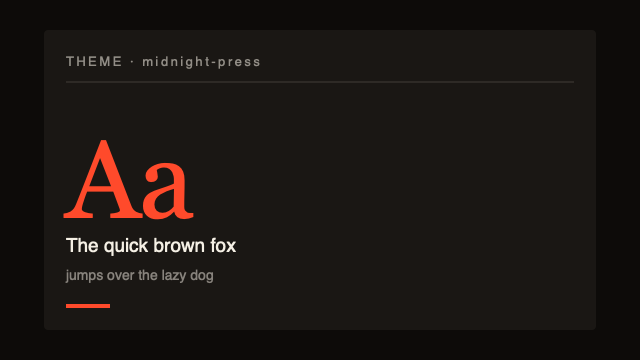
      <br/><sub><code>midnight-press</code> — Warm dark backdrop with a single hot accent. Cinematic, terminal-y, developer vibe.</sub>
    </td>
    <td align="center" width="50%" valign="top">
      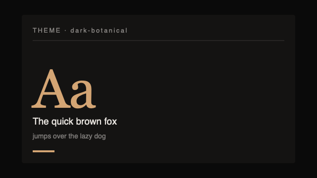
      <br/><sub><code>dark-botanical</code> — Premium editorial dark with elegant Cormorant italic and warm terracotta / blush / gold accents. Soft blurred light pools as the signature — magazine-cover sophistication for fashion, lifestyle, brand storytelling.</sub>
    </td>
  </tr>
  <tr>
    <td align="center" width="50%" valign="top">
      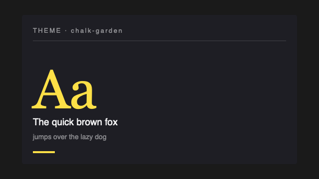
      <br/><sub><code>chalk-garden</code> — Dark slate chalkboard backdrop with handwritten Patrick Hand typography and a chalk-yellow accent. Friendly classroom / explainer vibe.</sub>
    </td>
    <td align="center" width="50%" valign="top">
      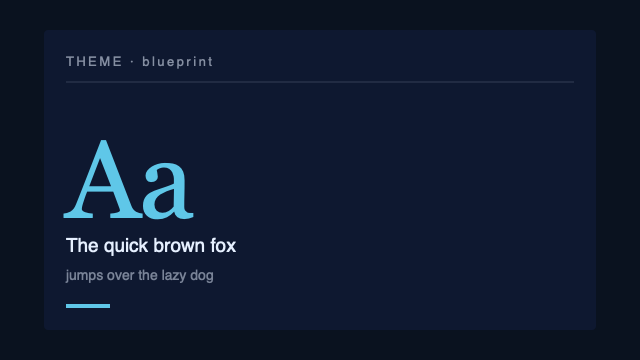
      <br/><sub><code>blueprint</code> — Deep navy backdrop with cyan accent and IBM Plex Mono. Engineering blueprint / industrial schematic vibe — best for system architecture and technical breakdowns.</sub>
    </td>
  </tr>
  <tr>
    <td align="center" width="50%" valign="top">
      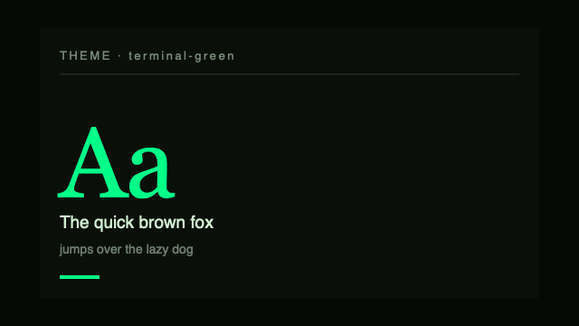
      <br/><sub><code>terminal-green</code> — True-black backdrop with phosphor-green accent and JetBrains Mono everywhere. Matrix / hacker / 80s terminal vibe — best for technical demos and CLI walkthroughs.</sub>
    </td>
    <td align="center" width="50%" valign="top">
      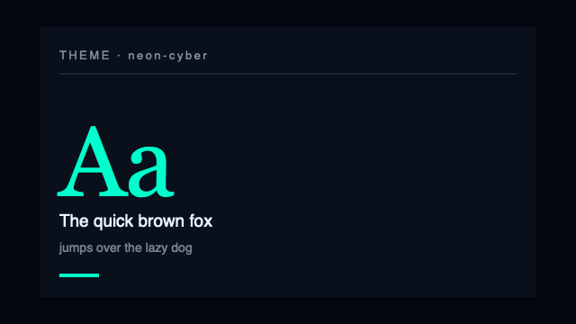
      <br/><sub><code>neon-cyber</code> — Deep-navy canvas with electric cyan + magenta glow and Clash Display + Satoshi typography. Signature: cyan grid + dual-tone neon outline. Futurist cyberpunk for AI, web3, security and future-tech content.</sub>
    </td>
  </tr>
  <tr>
    <td align="center" width="50%" valign="top">
      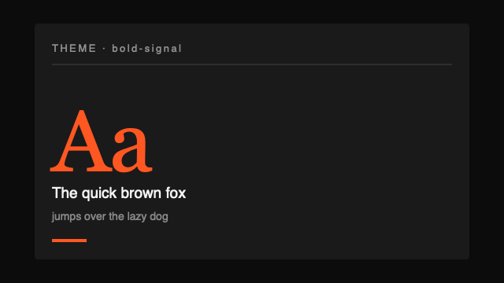
      <br/><sub><code>bold-signal</code> — Dark gradient backdrop with a hot orange focal card and Archivo Black / Space Grotesk typography. Signature: oversized orange focal card as the stage's anchor + tabular section numbers. Built for pitch decks, product launches and statement chapters.</sub>
    </td>
    <td align="center" width="50%" valign="top">
      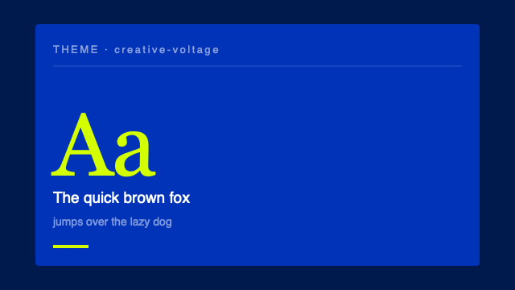
      <br/><sub><code>creative-voltage</code> — Saturated electric-blue canvas with neon-yellow accent and Syne / Space Mono typography. Signature: halftone dot pattern (retro-punk creative studio). Built for design weeks, creative-studio decks and visual culture talks.</sub>
    </td>
  </tr>
</table>

### Light · 15

<table>
  <tr>
    <td align="center" width="50%" valign="top">
      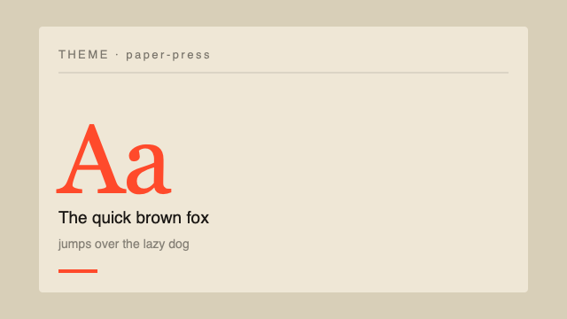
      <br/><sub><code>paper-press</code> — Warm cream backdrop with a single hot accent. Editorial magazine, gentle, daytime vibe.</sub>
    </td>
    <td align="center" width="50%" valign="top">
      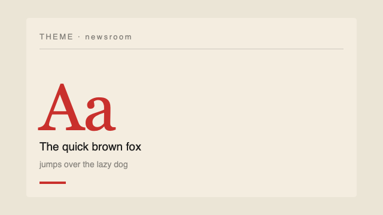
      <br/><sub><code>newsroom</code> — Newsprint cream backdrop with ink-black serif type and a banner red accent. Old-school broadsheet / documentary feel — feels like a New York Times feature article.</sub>
    </td>
  </tr>
  <tr>
    <td align="center" width="50%" valign="top">
      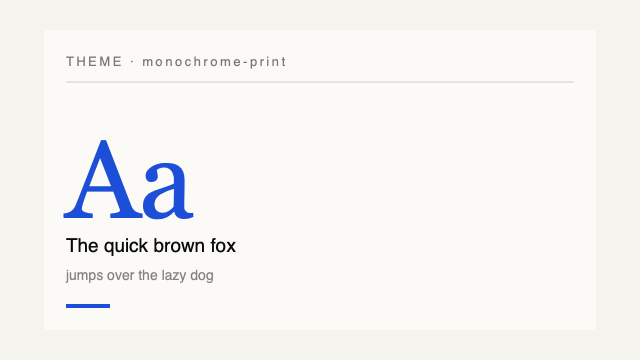
      <br/><sub><code>monochrome-print</code> — Off-white paper with ink-black serif text and a single ink-blue accent. High-contrast print magazine vibe — Monocle, Wallpaper, MIT Press. Quiet, sophisticated, considered.</sub>
    </td>
    <td align="center" width="50%" valign="top">
      
      <br/><sub><code>vintage-editorial</code> — Witty editorial cream canvas with chunky italic Fraunces and a warm terracotta accent. Signature: hairline geometric overlay (circle + line + dot). Personality-forward, conversational — like a magazine columnist who knows you'll laugh.</sub>
    </td>
  </tr>
  <tr>
    <td align="center" width="50%" valign="top">
      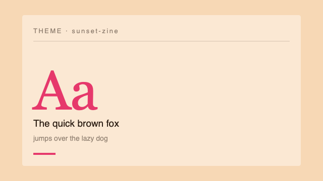
      <br/><sub><code>sunset-zine</code> — Warm peach paper backdrop with a magenta accent and chunky Fraunces serif. Indie magazine / risograph zine vibe — playful, expressive, character-forward.</sub>
    </td>
    <td align="center" width="50%" valign="top">
      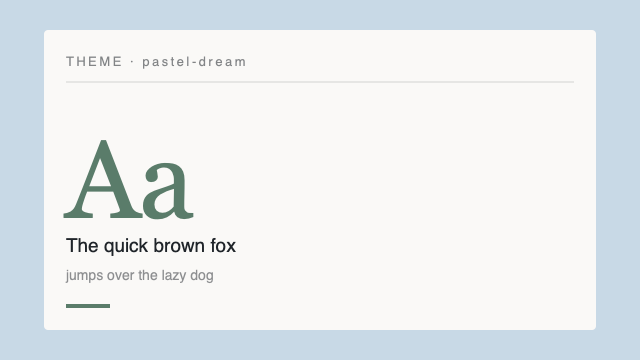
      <br/><sub><code>pastel-dream</code> — Soft pastel canvas with cream card and a single sage-green accent. Plus Jakarta Sans throughout, generous rounded cards. Signature: faint multi-tone pill ribbon along one edge — friendly without being saccharine.</sub>
    </td>
  </tr>
  <tr>
    <td align="center" width="50%" valign="top">
      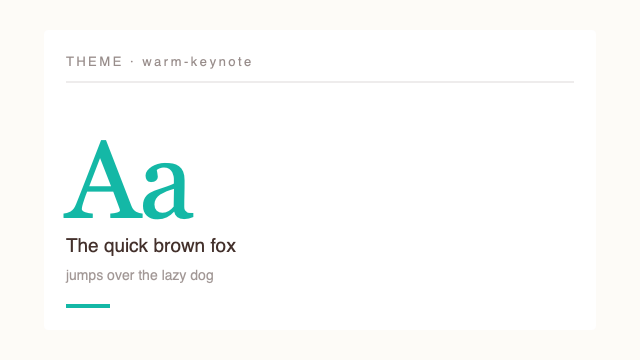
      <br/><sub><code>warm-keynote</code> — Cream paper backdrop with a single teal accent and a soft warm grid drawn on the stage. SaaS keynote / editorial vibe.</sub>
    </td>
    <td align="center" width="50%" valign="top">
      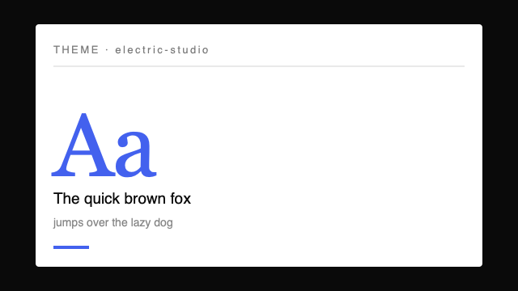
      <br/><sub><code>electric-studio</code> — Clean white canvas with single electric-blue accent and Manrope sans throughout. Signature: 4px electric-blue accent bar baked into the bottom of the stage — corporate confidence without coldness.</sub>
    </td>
  </tr>
  <tr>
    <td align="center" width="50%" valign="top">
      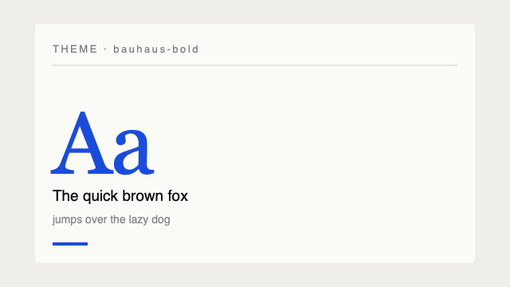
      <br/><sub><code>bauhaus-bold</code> — Pure off-white surface, primary-blue accent, and chunky Archivo Black display type. Bauhaus / brutalist modernist — best for opinionated manifestos and bold product pitches.</sub>
    </td>
    <td align="center" width="50%" valign="top">
      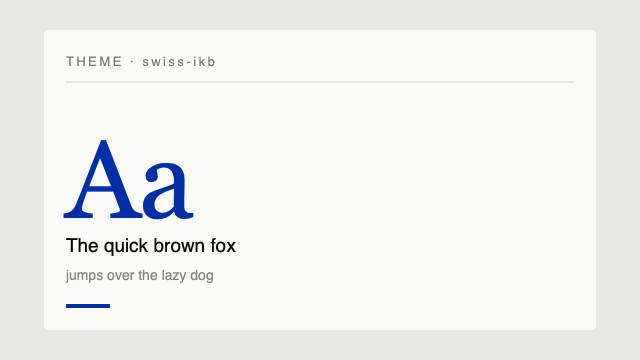
      <br/><sub><code>swiss-ikb</code> — Swiss International Style. Ultra-thin 200-weight Inter / Helvetica, crisp warm-white canvas, IKB (International Klein Blue) as the single high-saturation accent. Signature: 1px hairline grid + 200-weight hero numbers. Massimo Vignelli + Helvetica Forever energy.</sub>
    </td>
  </tr>
  <tr>
    <td align="center" width="50%" valign="top">
      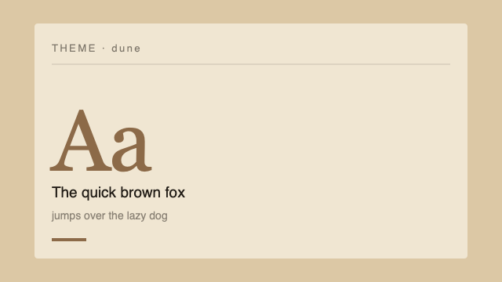
      <br/><sub><code>dune</code> — Charcoal-brown on desert sand — near-accent-less restraint. Inter sans display + Source Serif body. Architecture portfolio / gallery brochure / desert dusk aesthetic — quiet, sophisticated, design-first.</sub>
    </td>
    <td align="center" width="50%" valign="top">
      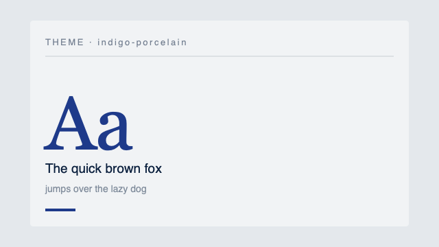
      <br/><sub><code>indigo-porcelain</code> — Deep-indigo ink on porcelain white — the indigo IS the ink, not just an accent. Playfair Display + Noto Serif SC + IBM Plex Sans body. Academic, scholarly, like a Chinese journal of contemporary thought.</sub>
    </td>
  </tr>
  <tr>
    <td align="center" width="50%" valign="top">
      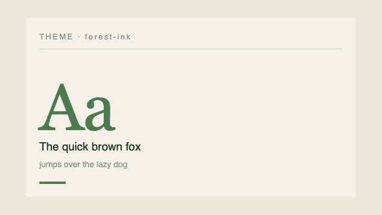
      <br/><sub><code>forest-ink</code> — Deep-forest-green ink on ivory cream — the green IS the ink. Source Serif body + Playfair Display + Noto Serif SC display. Reads like a vintage National Geographic issue — sustainable, grounded, considered.</sub>
    </td>
    <td align="center" width="50%" valign="top">
      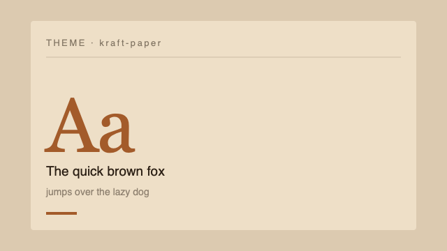
      <br/><sub><code>kraft-paper</code> — Deep-brown ink on kraft beige — old notebook / hand-stamped envelope. Fraunces serif + Noto Serif SC + Source Serif body. Vintage, warm, hand-crafted, with a copper accent for editorial emphasis.</sub>
    </td>
  </tr>
  <tr>
    <td align="center" width="50%" valign="top">
      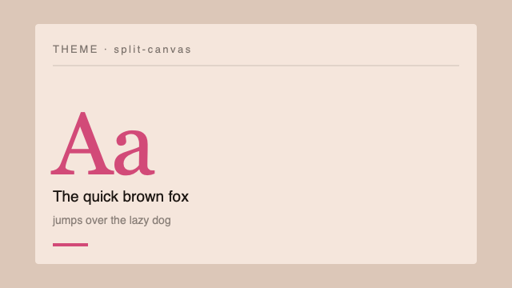
      <br/><sub><code>split-canvas</code> — Two-tone canvas: warm peach + cool lavender as paired surfaces. Outfit sans display, magenta accent. Signature: dual-tone surface (left peach / right lavender) — built for contrast and dialog chapters.</sub>
    </td>
    <td></td>
  </tr>
</table>

---

## What's inside

```
assets/web-video-presentation/
├── SKILL.md                    # the skill body (invoked, condensed)
├── references/                 # per-phase rules (lazy-loaded)
│   ├── SCRIPT-STYLE.md         # Chinese voiceover style
│   ├── SCRIPT-STYLE-EN.md      # English voiceover style
│   ├── CHAPTER-CRAFT.md        # single entry for chapter design
│   ├── OUTLINE-FORMAT.md / THEMES.md / THEME-INDEX.md
│   ├── AUDIO.md / RECORDING.md
│   └── EXAMPLES/
├── themes/                     # 23 themes (theme.json + tokens.css)
├── templates/                  # Vite + React + TS scaffold
└── scripts/scaffold.sh         # one-command project scaffold
```

---

## Requirements

- [DeepSeek Harness](https://github.com/deepseek-ai/deepseek-harness) (provides the `skills` service)
- Node.js + npm (for the generated project's `npm install` / `npm run dev`)

## License & attribution

MIT. The DSH plugin shell and the skill instructions are original to this repo; the `themes/`, `templates/`, `scripts/scaffold.sh` and `references/EXAMPLES/` derive from [ConardLi/garden-skills](https://github.com/ConardLi/garden-skills) (MIT) — see [THIRD_PARTY_NOTICES.md](THIRD_PARTY_NOTICES.md).
