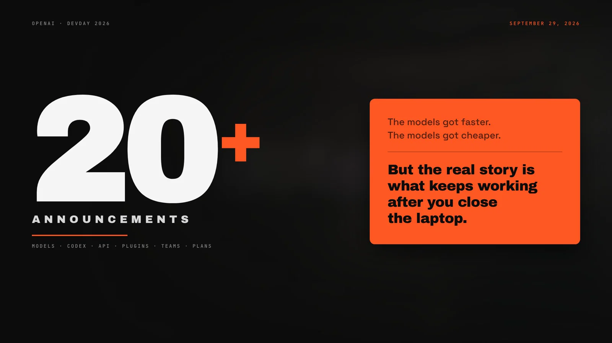

# Demo build notes — DevDay 2026 Recap



> 中文见下方 [中文](#中文说明)。
>
> **I watched OpenAI DevDay 2026 with DeepSeek. This is what it thought mattered most.**
> 10 chapters · 64 steps · 9:49 · English voiceover · theme `bold-signal`

## What this is

A real end-to-end run of this plugin: one article in, one finished video out.
It is kept here as a reference for what the workflow actually produces — including the
parts that went wrong and had to be fixed.

| | |
|---|---|
| Source | [`openai.com/index/devday-2026-recap`](https://openai.com/index/devday-2026-recap/) + 20 crawled subpages |
| Output | `devday-2026-recap.mp4` — 1920×1080, 30 fps, H.264 + AAC, 9:49, 47 MB |
| Structure | 10 chapters / 64 steps, one step = one narration beat |
| Theme | `bold-signal` |
| Voice | `en-US-AndrewMultilingualNeural` via `edge-tts` (free, no API key) |
| Assets | 27 official OpenAI key-art images, plus self-drawn charts — no fabricated screenshots |

## Pipeline

```
recap page + 20 subpages
  → article.md               facts, with a cited appendix per subpage
  → script.md                English voiceover, 1334 words; one `---` = one beat = one step
  → outline.md               10 chapters / 64 steps, each with a sourced information pool
  → presentation/            Vite + React + TS; chapter 1 built as the anchor, 2–10 in parallel
  → public/audio/            64 narration clips, 64/64 synthesized, 0 failures
  → ?auto=1 + fit=1          recorded in one take
```

Two details worth copying if you run this yourself:

- **`narrations.ts` is the single source of truth.** Its length *is* the chapter's step count, and it
  is also what the audio pipeline reads. That one constraint keeps script, outline, chapter code,
  the step counter and the audio from ever drifting apart.
- **Every chapter was reviewed by a separate agent before it shipped.** Not a self-check. The
  reviewer got the chapter code, the crisp checklist and the source facts, and returned
  pass/fail with evidence. It found real defects:

  | found | fix |
  |---|---|
  | Theme tokens were imported *before* `base.css`, so every theme personality knob was silently overridden (oblique hero numbers, wrong padding, wrong radii) | import order corrected — this affected the scaffold template itself |
  | A benchmark chart drew a 6.4-point delta as ~13 % of bar height | replaced with a zero-based axis that states its own scale on screen |
  | A diagram meant to show "one question → finite answers" rendered at 1.27:1 contrast and was covered by its own rows | contrast and geometry fixed; the fan is now the clearest thing on the screen |
  | A partner-logo wall cropped away 6 of 31 logos and rendered white-on-orange at 2.9:1 | figure re-laid out at the artwork's own 16:9; measured ≈7–11:1 |
  | The closing progress bar ran 7.6 s against 6.84 s of narration — Auto mode would have cut it | retimed; Auto mode has no "wait for the animation" fallback |
  | Nine money-adjacent labels sat at 3.16–4.35:1 (below AA) | all raised; a price-qualifying label is not decoration |
  | A CSS comment contained `*/`, which broke the production build | commented cleanly |

## How the recording was automated

Screen-recording by hand is fine — the deck is designed for `?auto=1` one-take capture. This run was
recorded programmatically instead:

1. `tools/record.mjs` drives Chrome through puppeteer-core over the **pipe** transport, opens
   `?auto=1&fit=1`, clicks the start gate (the gesture that unlocks audio), captures real compositor
   frames via `Page.startScreencast`, and records the wall-clock moment each step became active.
2. `tools/build_video.py` lays each narration clip at its **measured** offset — so audio cannot drift
   over 64 steps — materialises a constant-rate frame sequence, encodes with ffmpeg, and normalizes
   loudness to −16 LUFS.

`?fit=1` is a small addition made for this: it drops the stage's default letterbox margins so the
capture is edge-to-edge 1920×1080.

Two bugs found on the way: the concat demuxer drifted ~22 s because it mishandled frames held for
several seconds (fixed by materialising one file per output frame), and the first encode was 5 dB quiet.

## Files here

```
demo/
├── poster.webp        title frame, 1600×900
├── preview.webp       17 s animated preview, 229 KB
├── still-00.webp      cold open          still-16.webp  benchmark chart
├── still-29.webp      API fan diagram    still-44.webp  collaborative slides
├── still-59.webp      Daybreak wall      still-63.webp  closing frame
└── NOTES.md           this file
```

The full video is attached to this repository's
[latest release](https://github.com/Fuuuuuji/dsh-web-video-presentation/releases/latest).

---

## 中文说明

> **我和 DeepSeek 一起听了 OpenAI DevDay 2026，这是它觉得最核心的内容。**
> 10 章 · 64 步 · 9 分 49 秒 · 英文口播 · 主题 `bold-signal`

这是一次完整的真实产出：输入一篇文章，输出一部成片。把它留在这里，是想让人看到这套工作流
真正能做出什么 —— 包括过程中翻车、又被打回重做的地方。

| | |
|---|---|
| 输入 | [`openai.com/index/devday-2026-recap`](https://openai.com/index/devday-2026-recap/) + 下探抓取的 20 个子页面 |
| 产出 | `devday-2026-recap.mp4` —— 1920×1080 / 30fps / H.264 + AAC / 9 分 49 秒 / 47 MB |
| 结构 | 10 章 / 64 步，一步 = 一个口播节拍 |
| 主题 | `bold-signal` |
| 音色 | `en-US-AndrewMultilingualNeural`（`edge-tts`，免费、无需 API key） |
| 素材 | 27 张 OpenAI 官方发布图 + 自绘图表，没有一张假截图 |

**流程**：网页 + 20 个子页面 → `article.md`（带出处的事实底稿）→ `script.md`（英文口播 1334 词，
一个 `---` = 一个节拍 = 一个 step）→ `outline.md`（10 章 64 步，每章带来源标注的信息池）→
`presentation/`（Vite + React + TS，第 1 章主线程做锚点，第 2~10 章并行）→ 64 段音频全部合成成功
→ `?auto=1` 一镜到底录制。

两个值得照抄的点：

- **`narrations.ts` 是唯一真相源**。它的长度**就是**章节的 step 数，同时也是音频合成的输入。
  这一条约束让稿子、outline、章节代码、步进器、音频五者永远不会漂移。
- **每一章都由另一个独立 agent 对抗式审查后才算过**，不是自己检查。reviewer 拿到章节代码、
  逐项清单和原文事实，返回 pass/fail + 证据。它抓出来的都是真问题：

  | 查出 | 修法 |
  |---|---|
  | 主题 token 被 `base.css` 覆盖（import 顺序错），主题人格参数全部失效（hero 数字变斜体、内边距和圆角都不对） | 修正 import 顺序 —— 这个 bug 连插件模板本身都有 |
  | 跑分图把 6.4 个百分点画成了约 13% 的柱高 | 换成从 0 起算的坐标轴，并在画面上标出自己的刻度 |
  | 本该表达「一个问题 → 有限答案」的示意图对比度只有 1.27:1，还被自己的行挡住 | 修对比度与几何，现在它是那屏最清楚的东西 |
  | 合作方 logo 墙裁掉了 31 个里的 6 个，白 logo 在橙底上只有 2.9:1 | 按图片本身的 16:9 重排，实测约 7–11:1 |
  | 收尾进度条 7.6 秒，当段口播只有 6.84 秒 —— Auto 模式会把它切断 | 重定时；Auto 模式没有「等动画跑完」的兜底 |
  | 9 个与价格/权益相关的标签对比度只有 3.16–4.35:1（低于 AA） | 全部提高；限定价格的标签不是装饰 |
  | 一段 CSS 注释里含 `*/`，直接把生产构建搞挂 | 注释改写 |

**录制**：手动录屏完全可以（这套东西就是为 `?auto=1` 一镜到底设计的）。这一次是程序化录的：
`tools/record.mjs` 用 puppeteer-core 走 pipe 通道驱动 Chrome，打开 `?auto=1&fit=1`，点击启动蒙层
（解锁音频所需的用户手势），通过 `Page.startScreencast` 抓真实合成帧，并记录每一步被激活的墙上
时钟；`tools/build_video.py` 把每段口播按**实测偏移**铺到时间线上（所以 64 步也不会累积漂移），
铺成恒定帧率序列，用 ffmpeg 编码并做 −16 LUFS 响度归一。

为此加了一个小开关 `?fit=1`：去掉舞台默认的留边，让录屏是真正贴边的 1920×1080。

路上踩的两个坑：concat demuxer 对「一张图停好几秒」处理不对，导致约 22 秒漂移（改成每个输出帧
生成一个文件后解决）；第一次编码整体轻了 5 dB。
